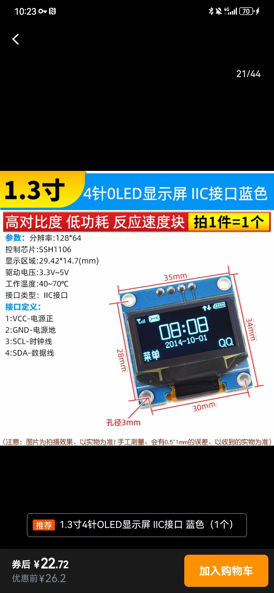

# pi5-oled-i2c-tools

树莓派 Pi5 使用 I2C 接口驱动 OLED 显示屏的示例代码。

## 依赖安装

```bash
pip install luma.oled Pillow
```

如需显示中文，请先安装中文字体：

```bash
sudo apt-get install fonts-wqy-zenhei
```

确认 I²C 已启用

```bash
sudo raspi-config
```

## 接线说明

| OLED 引脚 | Raspberry Pi5 引脚 |
|-----------|-------------------|
| VCC       | 1 (3.3V)          |
| GND       | 9 (GND)           |
| SCL       | 5 (GPIO3 / SCL1)  |
| SDA       | 3 (GPIO2 / SDA1)  |
连接完成后，开启 I2C 接口并重启树莓派即可。

## 判定 OLED 控制器型号

0.96″/1.3″ 常见 I²C OLED 模块主要有两种控制器：

| 外观特征 | 常用地址 | 正确驱动 |
|----------|---------|---------|
| 模块右下角 4 针，背面印 “SSD1306” 或无标识 | 0x3C / 0x3D | `ssd1306` |
| 背面贴一颗方形芯片，上印 “SH1106G” 或出厂没贴纸 | 0x3C | `sh1106` |

请根据实际芯片选择对应驱动，示例代码默认为 `ssd1306`。

## 查找 I²C 总线

树莓派可能存在多个 I²C 总线，可以先查看所有可用的总线：

```bash
i2cdetect -l
```

示例输出：

```text
i2c-1   i2c        Synopsys DesignWare I2C adapter  I2C adapter
i2c-10  i2c        Synopsys DesignWare I2C adapter  I2C adapter
i2c-13  i2c        107d508200.i2c                   I2C adapter
i2c-14  i2c        107d508280.i2c                   I2C adapter
```

随后依次执行以下命令寻找屏幕所在的总线（能扫到 `0x3C` 或其他地址即为正确总线）：

```bash
sudo i2cdetect -y 1
sudo i2cdetect -y 10
sudo i2cdetect -y 13
sudo i2cdetect -y 14
```

确定总线和地址后，可在代码中这样初始化设备：

```python
device = init_display(i2c_port=10, i2c_address=0x3C, driver="sh1106")
```

## 示例

- `main.py`：显示默认的温度和湿度信息（例如 25°C，40%）。 屏幕上会以中文显示温度和湿度。

运行示例：

```bash
python main.py
```

示例设备图片：


